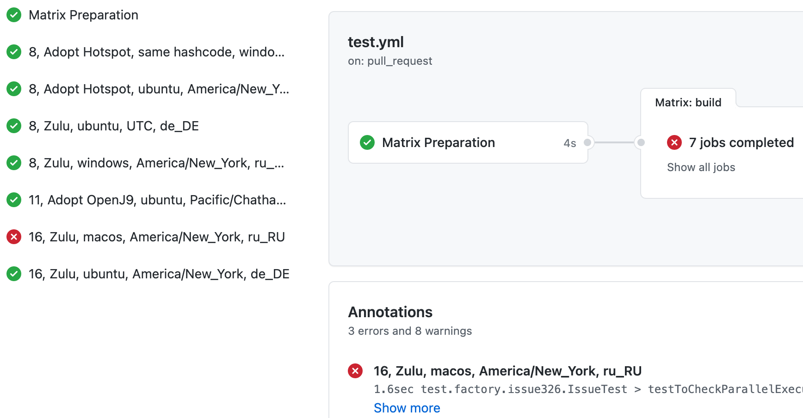

About
=====

Generate GitHub Actions matrix on the fly based on your constraints.

Usage
-----

Copy [matrix_builder.js](src/matrix_builder.js) to your repository as `.github/workflows/matrix_builder.js`

Add `.github/workflows/matrix.js` as follows (see sample [matrix.js](examples/matrix.js)):

```javascript
let {MatrixBuilder} = require('./matrix_builder');
const matrix = new MatrixBuilder();
// Add axes for the matrix
matrix.addAxis({
  name: 'tz',
  values: [
    'America/New_York',
    'Pacific/Chatham',
    'UTC'
  ]
});
matrix.addAxis({
  name: 'os',
  title: x => x.replace('-latest', ''),
  values: [
    'ubuntu-latest',
    'windows-latest',
    'macos-latest'
  ]
});
matrix.addAxis({
  name: 'locale',
  title: x => x.language + '_' + x.country,
  values: [
    {language: 'de', country: 'DE'},
    {language: 'fr', country: 'FR'},
    {language: 'ru', country: 'RU'},
    {language: 'tr', country: 'TR'},
  ]
});

// Configure the order of the fields in job name
matrix.setNamePattern(['os', 'tz', 'locale']);

// Exclude testing de_DE locale with macos-latest
matrix.exclude({locale: {language: 'de'}}, {os: ['macos-latest']});
// Ensure at least one windows and at least one linux job is present (macos is almost the same as linux)
matrix.generateRow({os: 'windows-latest'});
matrix.generateRow({os: 'ubuntu-latest'});

// Generate more rows, no duplicates would be generated
const include = matrix.generateRows(process.env.MATRIX_JOBS || 5);
if (include.length === 0) {
  throw new Error('Matrix list is empty');
}
// Sort jobs by name, however, numeric parts are sorted approrpiately
// For instance, 'windows 8' would come before 'windows 11'
include.sort((a, b) => a.name.localeCompare(b.name, undefined, {numeric: true}));

console.log(include);
console.log('::set-output name=matrix::' + JSON.stringify({include}));
```

Note: you can test the matrix locally with `node .github/workflows/matrix.js`

Configure workflow yml to call the dynamic matrix:

```yaml
jobs:
  matrix_prep:
    name: Matrix Preparation
    runs-on: ubuntu-latest
    outputs:
      matrix: ${{ steps.set-matrix.outputs.matrix }}
    env:
      # Ask matrix.js to produce 7 jobs
      MATRIX_JOBS: 7
    steps:
      - uses: actions/checkout@v2
        with:
          fetch-depth: 1
      - id: set-matrix
        run: |
          node .github/workflows/matrix.js

  build:
    needs: matrix_prep
    runs-on: ${{ matrix.os }}
    strategy:
      fail-fast: false
      matrix: ${{fromJson(needs.matrix_prep.outputs.matrix)}}
    name: '${{ matrix.name }}'
    env:
      TZ: ${{ matrix.tz }}
```

In case you wonder, the builder generates the following json:

```javascript
[
  {
    jdk: { group: 'Zulu', version: '8', distribution: 'zulu' },
    tz: 'UTC',
    os: 'windows-latest',
    locale: { language: 'de', country: 'DE' },
    name: '8, Zulu, same hashcode, windows, UTC, de_DE',
    testExtraJvmArgs: '-XX:+UnlockExperimentalVMOptions -XX:hashCode=2 -Duser.country=DE -Duser.language=de'
  },
  {
    jdk: {
      group: 'Adopt Hotspot',
      version: '11',
      distribution: 'adopt-hotspot'
    },
    tz: 'Pacific/Chatham',
    os: 'ubuntu-latest',
    locale: { language: 'ru', country: 'RU' },
    name: '11, Adopt Hotspot, ubuntu, Pacific/Chatham, ru_RU',
    testExtraJvmArgs: '-Duser.country=RU -Duser.language=ru'
  },
  {
    jdk: { group: 'Zulu', version: '11', distribution: 'zulu' },
    tz: 'America/New_York',
    os: 'ubuntu-latest',
    locale: { language: 'tr', country: 'TR' },
    name: '11, Zulu, ubuntu, America/New_York, tr_TR',
    testExtraJvmArgs: '-Duser.country=TR -Duser.language=tr'
  }
]
```


Features
--------

* Matrix generation is fast (matrix job takes ~5 seconds in total)
* Random matrix enables to cover unusual cases and keep CI duration reasonable by keeping the limited number of CI jobs
* Global `exclude` and `include` filters enable to fine tune the matrix (~avoid generating unreasonable combinations)
* Literal filters: `{os: 'windows-latest'}`
* Array filters: `{os: ['windows-latest', 'linux-latest']}`
* Function filters: `{os: x => x>='w'}`


Sample output
-------------

See https://github.com/cbeust/testng/pull/2584



Sample integrations
-------------------

TestNG: https://github.com/cbeust/testng/pull/2584

License
-------
Apache License 2.0

Change log
----------
v1.0
* Initial release

Author
------
Vladimir Sitnikov <sitnikov.vladimir@gmail.com>
